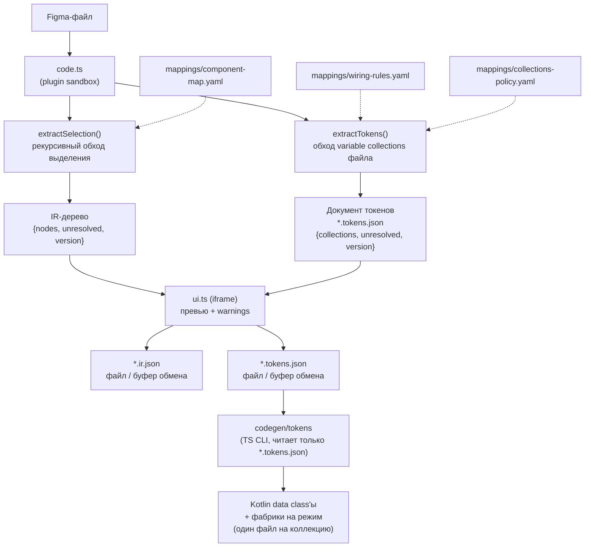

# Figma-Normalizator — как оно работает (по шагам)

Состояние: миграция `codegen/tokens` на TS-генератор из документа токенов
завершена (см. `schema/tokens/MIGRATION.md`). Все 388 тестов проходят (`npm test`).

---

## 0. Что это вообще и зачем

Figma REST API отдаёт «геометрию без смысла»: абсолютные координаты, вектора,
низкоуровневые enum'ы Auto Layout, инстансы компонентов развёрнутые в полное
поддерево, цвета как литералы с непрозрачными id переменных, без информации о
темах/режимах.

Figma **Plugin API** (работающий внутри самой Figma) видит то, чего не видит REST:
резолвнутые component properties, styled text segments, режимы переменных.
Проект использует это и выдаёт чистый версионированный **IR** (Intermediate
Representation), который потом сможет потреблять кодогенератор, не зная ничего
о внутренней модели документа Figma.

**Stage 1** = извлечение на стороне Figma (IR узлов + документ токенов). С
миграцией `codegen/tokens` (см. §6) добавилась и первая кодогенерация: Kotlin
data class'ы из документа токенов. MCP-сервера и LLM внутри плагина по-прежнему
нет.

---

## 1. Структура монорепозитория

npm workspaces, 5 пакетов, всё на TypeScript — внешнего Python-инструмента
больше нет (см. §6, ранее `tools/figma-tokens`, затем
`codegen/tokens/_legacy-python/`, удалён этой миграцией):

```
schema/         @figma-normalizator/schema         — JSON Schema (IR v1 + Token v1) + сгенерированные TS-типы
plugin/         @figma-normalizator/plugin         — сам плагин Figma (extractor + UI-панель), отдаёт IR-документ и документ токенов
mappings/       @figma-normalizator/mappings       — component-map.yaml, wiring-rules (токен → Kotlin-символ), collections-policy
fixtures/       @figma-normalizator/fixtures       — корпус мок-сценариев + real-world-фикстуры + замороженные снапшоты IR
codegen/tokens/ @figma-normalizator/codegen-tokens — TS-генератор Kotlin data class'ов из документа токенов (*.tokens.json), CLI `codegen-tokens`
```

CI (`.github/workflows/ci.yml`): `npm install` → `lint` → `typecheck` →
`verify:generated` → `build` → `test` → `verify:generated` →
`codegen-tokens --check` (смок-тест реального CLI против замороженного
`codegen/tokens/testdata/golden/real-world/`, см. §6) на каждый push в main и
на каждый PR. Node 20.

---

## 2. Поток данных целиком



Ключевая мысль: **две независимые ветки**, которые сходятся только в поле
`token.symbol` (проставляется во время экспорта токенов, см. §5.2):

- ветка «структура экрана» — плагин → IR;
- ветка «дизайн-токены» — плагин → документ токенов → `codegen/tokens` → Kotlin.

`codegen/tokens` работает **только** с уже резолвленным IR-документом токенов;
он не знает про Figma REST/Plugin API и не ходит в сеть — вся резолюция
(алиасы, режимы, политика исключений, символы) уже произошла на стороне
плагина.

---

## 3. Шаг за шагом: жизненный цикл одного экспорта

### Шаг 3.1. Запуск плагина

`plugin/manifest.json`:

- `main: dist/code.js`, `ui: dist/ui.html`
- `editorType: ["figma", "dev"]`, `capabilities: ["inspect"]` (панель Dev Mode)
- `documentAccess: "dynamic-page"`, `networkAccess.allowedDomains: ["none"]` — сеть запрещена

`code.ts → initializePlugin(figma)`:

1. `figma.showUI(__html__, {width: 360, height: 560})` — панель живёт всю сессию.
2. Сразу постит `selection-changed` в UI.
3. Подписывается на `figma.on("selectionchange")` и на `figma.ui.on("message")`.

Протокол сообщений — `plugin/src/messages.ts` (единый источник правды для обеих сторон):

- Plugin → UI: `selection-changed`, `ir-result`, `error` (коды: `empty-selection`,
  `budget-exceeded`, `node-not-found`, `unsupported`, `unknown`, `symbol-leak`).
- UI → Plugin: `extract`, `select-node`, `export`.

### Шаг 3.2. Нажатие Extract → `handleExtract()`

1. Пустое выделение → `error: empty-selection`.
2. `extractSelection(figma, selection, { fileKey: figma.fileKey ?? "" })` — **без** `version`,
   версия считается позже как хэш контента.
3. `findSymbolPath(result)` — защита в глубину: рекурсивный поиск любого `Symbol`
   в готовом дереве. `postMessage` использует structured clone, который не умеет
   сериализовать `Symbol` (`figma.mixed`) и уронил бы панель с невнятной ошибкой
   «Cannot unwrap symbol». Здесь вместо этого — понятный `symbol-leak` с путём.
4. Постит `ir-result` + `source: {fileKey, nodeId, version}`.
5. `NodeBudgetExceededError` → `error: budget-exceeded` (баннер, не тихое усечение).

### Шаг 3.3. Обход дерева — `extractor/index.ts`

Функция `extractNode(figma, node, parent, ctx, budget, source, isTopLevel)`:

```
budget.tick()                     ← бюджет узлов + кооперативный yield
  ↓
node.visible === false            → null (выбрасываем)
  ↓
isAssetNode(node)                 → asset-нода (не спускаемся внутрь)
  ↓
type === "INSTANCE"               → buildInstanceNode()
      ├── kind: "mapped"          → opaque instance-нода, дети НЕ обходятся
      └── kind: "unmapped"        → фолбэк в handleContainerLike() (дети обходятся!)
  ↓
type === "TEXT"                   → buildTextNode()
  ↓
FRAME/COMPONENT/COMPONENT_SET/    → handleContainerLike()
GROUP/BOOLEAN_OPERATION/SECTION
  ↓
всё остальное                     → null
```

`handleContainerLike()` — три случая:

- 0 детей и нет Auto Layout → `null` (пустой фрейм не несёт информации);
- 1 ребёнок и нет Auto Layout → **прозрачная обёртка**, рекурсия сразу в ребёнка
  (имя обёртки всё равно попадает в `source.path`);
- иначе → `buildLayoutNode()`.

`buildLayoutNode()` собирает `LayoutNode`: `direction`, `gap`, `padding`,
`mainAxisAlign`, `crossAxisAlign`, `sizing`, `background`, `cornerRadius`,
`children`, `source`. Дети обходятся, затем к ним применяются `collapseLists()` и
`groupOverlayChildren()`.

### Шаг 3.4. Нормализация layout — `extractor/layout.ts`

| Figma                                                 | IR                                             |
| ----------------------------------------------------- | ---------------------------------------------- |
| `layoutMode: HORIZONTAL/VERTICAL/иное`                | `direction: row / column / stack`              |
| `primaryAxisAlignItems: MIN/MAX/CENTER/SPACE_BETWEEN` | `mainAxisAlign: start/end/center/spaceBetween` |
| `counterAxisAlignItems: MIN/MAX/CENTER/BASELINE`      | `crossAxisAlign: start/end/center/start`       |
| все дети с `layoutAlign === "STRETCH"`                | `crossAxisAlign: "stretch"`                    |

`resolveSizing(node, parent)` — документированная эвристика с приоритетами:

1. родитель — Auto Layout и нода тянется (`layoutGrow === 1` по главной оси или
   `layoutAlign === "STRETCH"` по поперечной) → `fill`;
2. иначе сама нода — Auto Layout → её `primaryAxisSizingMode`/`counterAxisSizingMode`:
   `AUTO → hug`, `FIXED → fixed`;
3. иначе → `fixed`.

`padding`: если все 4 стороны равны — эмитится сокращение `{ all }`, иначе 4 поля.

### Шаг 3.5. Резолв токенов — `extractor/tokens.ts` (сердце проекта)

`resolveTokenValue(figma, nodeId, boundVariables, field, rawValue)`:

- нет привязки в `boundVariables[field]` → `{ token: null, value: rawValue }` +
  `UnresolvedEntry("unbound-literal")`. Путь токена **никогда не выдумывается**;
- есть привязка → `resolveVariable()`.

`resolveVariable(figma, variableId)` возвращает `{ token, value, modes?, symbol? }`:

- `token` = `variable.name` как есть (в Figma имена переменных уже через `/`);
- `modes` = `{ имя_режима → значение }` из `valuesByMode` + имена режимов коллекции
  (эмитится только если режимов > 1);
- `value` = значение режима по умолчанию коллекции;
- `symbol` = `resolveTokenSymbol(collection, variable.name)` из скомпилированных
  `mappings/wiring-rules.yaml` (см. §5.2).

**Резолв алиасов** (`resolveModeValue`) — самая нетривиальная часть:

- значение режима может быть не литералом, а `{type: "VARIABLE_ALIAS", id}` —
  так семантические токены строятся поверх примитивных;
- алиасы разворачиваются **рекурсивно**, до литерала;
- эмитится всегда имя **внешней** (семантической) переменной, не примитива;
- **кросс-коллекционное сопоставление режимов**: у целевой переменной может быть
  другой набор режимов. Ищется режим с **тем же именем**; если нет — берётся
  `defaultModeId` целевой коллекции (осознанное решение, задокументировано в README);
- **защита от циклов**: `MAX_ALIAS_DEPTH = 10` + множество посещённых id →
  `UnresolvableAliasChainError` → `UnresolvedEntry("unresolvable-alias-chain")`.

Цвет: `colorToHex()` → `#RRGGBB` или `#RRGGBBAA` (альфа добавляется только при `a < 1`).

`resolveFillColor()`: берёт **первый видимый SOLID** paint. Если `fills` — `figma.mixed`
(Symbol) → `mixed-value`. Если SOLID-заливок нет вообще → `null` без варнинга
(«нет цвета» ≠ «цвет не резолвнулся»).

`resolveTypographyToken()`: смотрит привязку `fontName`, затем `fontSize`; возвращает
`TokenRef { token, symbol? }` или `{ token: null }` + `unbound-literal`.

### Шаг 3.6. Текст — `extractor/text.ts`

`node.getStyledTextSegments(["fontSize","fontName","fills","boundVariables"])`:

- 0–1 сегмент → `text` = строка, `typography`/`color` на уровне ноды;
- 2+ сегментов → `text` = массив `StyledSegment[]` (`{text, typography, color}`),
  а `typography`/`color` ноды = `null` (нет единого стиля).

### Шаг 3.7. Инстансы — `extractor/instance.ts` + `mappings/src/index.ts`

1. `getMainComponentAsync()`; `null` → `missing-main-component`.
2. `resolveComponentSetName()` — идём вверх до `COMPONENT_SET`, иначе имя компонента.
3. `safeReadComponentProperties(node)` — `componentProperties` это **геттер**, который
   может бросить исключение при конфликтующих variant-определениях в самом файле Figma →
   `unreadable-component-properties`, инстанс становится unmapped (дети обходятся).
4. `findComponentMapEntry(имя)` — **точное строковое совпадение** по `component-map.yaml`.
5. `resolveRouting(entry, variantValues)` — структурная развилка
   (`Buttons` + `Type=Icon Only` → `Buttons (Type=Icon Only)` → `AppIconButton`).
6. `status === "mapped"` — единственный авторитетный сигнал. Блок `compose` может быть
   заполнен и при `status: unmapped` (Checkbox/Radio Button документируют «когда-нибудь»),
   это НЕ считается маппингом.
7. Для mapped-инстанса собираются `props`/`slots`:
   - `VARIANT` → `resolveStateValue()` (Switch: `State=On` → `checked=true`), затем
     `resolveVariantValue()` → `{variant, from}` или `{variant: null, from}` + `unmapped-variant`;
     `no-mapping` (например чистый роутинговый `Type`) — молча пропускается;
   - `TEXT` → единственное текстовое свойство кладётся в `props.text` (конвенция Figma),
     несколько — по camelCase-именам;
   - `BOOLEAN` → `props[camelCase] = {value}`;
   - `INSTANCE_SWAP` → `slots[camelCase] = null` (содержимое слота не резолвится — отложено).
8. **Граница инстанса**: opaque только если mapped. Unmapped-инстанс проваливается в
   `handleContainerLike()` и его реальные дети извлекаются (варнинг сохраняется —
   это гигиена, а не усечение).

### Шаг 3.8. Списки — `extractor/list.ts`

`structuralSignature(node)` — детерминированная подпись без контента: `type`,
`layoutMode`, отсортированные **имена** (не значения) component properties, рекурсивно дети.
Сравнение через `JSON.stringify`. Прогон из **3+** подряд идущих структурно одинаковых
соседей с одинаковым `layoutPositioning` схлопывается в `ListNode { itemTemplate, itemCount }`.
Если геттер `componentProperties` бросил — подпись получает уникальный маркер-счётчик
(fail-safe: «не похож ни на кого, включая другого сломанного соседа»).

### Шаг 3.9. Оверлеи — `extractor/overlay.ts`

Дети с `layoutPositioning === "ABSOLUTE"` вынимаются из потока и собираются в один
`OverlayNode`, вставляемый на позицию первого такого ребёнка. У каждого — `align`
(`computeOverlayAlign`: родитель делится на трети по каждой оси, ребёнок бакетится по
центру) и `offset {x, y}`. Синтетический `source.nodeId` = `"<parentId>#overlay"`.
Плюс `UnresolvedEntry("absolute-positioning")` — чтобы дизайнер это увидел.

### Шаг 3.10. Ассеты — `extractor/asset.ts`

`isAssetNode()`: `VECTOR`; или `INSTANCE`, в имени которого есть «icon»; или
контейнер, **все** потомки которого векторо-подобные (`VECTOR/BOOLEAN_OPERATION/
STAR/ELLIPSE/RECTANGLE/LINE/POLYGON`).

`inferAssetType()`: имя содержит «icon» → `icon`; иначе top-level и ≥120×120 →
`illustration`; иначе `image`.
`exportRef` = `slugify(node.name)` → `icon_chevron_right`. Геометрия/path-данные
никогда не эмитятся — только ссылка на экспорт + размеры.

### Шаг 3.11. Бюджет — `extractor/budget.ts`

`DEFAULT_NODE_BUDGET = 5000` узлов; каждые `YIELD_EVERY = 200` узлов —
`await setTimeout(0)` (кооперативная отдача потока, чтобы песочница не зависала).
Превышение → исключение, а не тихое усечение.

### Шаг 3.12. Provenance и версия — `provenance.ts` + `versioning.ts` + `canonical.ts`

Каждая IR-нода несёт `source: { nodeId, fileKey, version, path }`, где `path` —
цепочка имён узлов от корня выделения **включая собственное имя**.

`version` — **не** версия файла Figma (Plugin API её не отдаёт per-node). Это
детерминированный хэш контента: `canonicalStringify(nodes)` → FNV-1a 64-bit →
`c1-<16 hex>`. `VERSION_SCHEME = "c1"` позволит отличить будущую смену алгоритма.
После вычисления `withVersion()` рекурсивно проставляет его во все `Provenance`-блоки
(они определяются структурно — по наличию `nodeId/fileKey/version/path`).

`canonicalize()` рекурсивно сортирует ключи всех объектов (порядок массивов не трогает —
он смысловой). Через него идут: файл, буфер обмена и хэш версии. Гарантия:
**повторный экспорт неизменённого выделения даёт побайтово идентичный результат.**
Тест `determinism.test.ts` проверяет именно строковое равенство, не `toEqual`.

### Шаг 3.13. Панель UI — `ui.ts` + `ui/*`

- Шапка: имя и тип текущего выделения (обновляется на `selectionchange`).
- **Extract** → JSON-превью (`result.nodes`) + список **Warnings**, сгруппированный
  по `reason` (`ui/warnings.ts` → `buildWarningsViewModel`), у каждой записи
  `detail` + `nodeId` + кнопка **Select** (шлёт `select-node`, плагин делает
  `currentPage.selection = [node]` + `viewport.scrollAndZoomIntoView`).
- **Collapse all / Expand all** — сворачивает записи, оставляя заголовки групп
  и счётчики (для экранов с десятками `unmapped-component`).
- **Export** → скачивание `{fileKey}_{nodeId}_{version}.ir.json` (`ui/filename.ts`,
  небезопасные символы → `-`).
- **Copy to clipboard** → `ui/clipboard.ts`: сначала `navigator.clipboard.writeText`,
  при неудаче — фолбэк на `document.execCommand("copy")` через скрытую textarea,
  при полном провале — видимый статус-текст (никогда не молча).
- Вся нетривиальная логика вынесена в чистые функции и покрыта тестами; сам `ui.ts` —
  только DOM-проводка.

### Шаг 3.14. Сборка

`plugin/scripts/build.mjs` (esbuild): `src/code.ts` → `dist/code.js` (IIFE, es2017);
`src/ui.ts` бандлится в память и инлайнится в `dist/ui.html` вместо плейсхолдера
`<!-- BUILD:UI_SCRIPT -->` (у iframe плагина нет загрузки внешних ресурсов).
`dist/` в `.gitignore`.

---

## 4. Схема IR v1 — `schema/ir/v1/schema.json`

Дискриминированное объединение по `kind`, 6 видов нод. Везде `additionalProperties: false`.

| kind       | обязательные поля                                                                                          |
| ---------- | ---------------------------------------------------------------------------------------------------------- |
| `layout`   | direction, gap, padding, mainAxisAlign, crossAxisAlign, sizing, background, cornerRadius, children, source |
| `text`     | text (string \| StyledSegment[]), typography, color, source                                                |
| `instance` | component, figmaComponentSetName, figmaComponentKey, props, slots, layout, unresolved, source              |
| `asset`    | assetType (icon\|image\|illustration), exportRef, width, height, source                                    |
| `overlay`  | children[{node, align, offset?}], source                                                                   |
| `list`     | itemTemplate, itemCount, source                                                                            |

Вспомогательные типы: `Provenance`, `TokenValue {token, value, modes?, symbol?}`,
`TokenRef {token, symbol?}`, `UnresolvedEntry {nodeId, reason, detail?}`,
`PropValue` (TextOrBoolean `{value}` | Variant `{variant, from}`), `Sizing`, `Padding`,
`LayoutFieldsPartial`.

Инварианты, зафиксированные прямо в `description` схемы:

- IR от одного и того же входа обязан быть побайтово одинаковым — никаких таймстампов,
  случайных id и недетерминированного порядка;
- любое нерезолвнутое значение обязано попасть в ближайший `unresolved[]`, а не быть
  тихо подменённым или выброшенным;
- ломающее изменение любой ноды требует соседней схемы `v2`.

TS-типы генерируются из схемы (`schema/scripts/generate-types.mjs` → `src/generated/ir.ts`,
руками не править). `irSchemaV1` экспортируется для рантайм-валидации через ajv.

---

## 5. Mappings

### 5.1. component-map.yaml

Источник: библиотека Figma **NUI - iOS Components** (`z4Ns3yQoXwMgjky6H9WYtP`) →
Compose-компоненты **Android_Avalon** (`com.dexcom.platform.design.component.*`).

**Всего 10 записей**: 7 mapped (Buttons, Buttons (Type=Icon Only), Badges, Banners,
Info Box, Tags, Switch), 3 unmapped (Checkbox, Radio Button, Accordions).

Ключевые концепции: `status` (mapped/unmapped на уровне записи и отдельного значения),
обязательный `reason` у всего unmapped, `routing` (структурная развилка),
`mappingKind: state-based` + `stateMapping` (Switch/Checkbox/Radio), `notes`.
Покрываются **только** VARIANT-свойства; TEXT/BOOLEAN/INSTANCE_SWAP — задача экстрактора.

YAML компилируется в `src/generated/component-map.json` скриптом `generate-map.mjs`
(руками не править — регенерировать и коммитить).

### 5.2. wiring-rules (было: token-map)

`mappings/wiring-rules.yaml` — декларативные правила, сопоставляющие
**квалифицированный** токен `(collection, path)` (например, `base` +
`color/surface/action/primary/default`) с Kotlin call-site символом
(`AppTheme.semanticColors.surface.action.primary.default`). Компилируются в
`src/generated/wiring-rules.json` скриптом `generate-wiring-rules.mjs` и
применяются **во время экспорта токенов плагином** (`extractTokens()`, не в
`codegen/tokens`): каждый токен документа получает `token.symbol` +
`token.symbolFrom` (имя сработавшего правила) или остаётся `symbol: null` с
причиной — резолюция никогда не угадывает.

Единственное подтверждённое 1:1-правило — `base-color`: ветка `color/`
коллекции `base` совпадает с `DsThemeColors.kt`'s
`typealias SemanticColors = ...token.base.color.Color` посегментно. Остальные
ветки `base` (`opacity`, `radius`, `border-width`, `effect`, `scale`, `apple`)
и все прочие коллекции (`components`, `layout`, `primitives`, `typography`,
…) — не выводятся механически (`themedata/`-классы не 1:1 переименование) и
остаются `symbol: null`.

Это заменило прежний `token-map` — плоский артефакт **2371 строки**,
сгенерированный один раз из даунстрим-снапшота и вручную забандленный: из них
только 246 строк реально несли символ (и все 246 — от одного и того же
правила), треть забандленных строк к моменту аудита ссылалась на удалённые
токены, а lookup по одному `path` был структурно неоднозначен (`base` и
`stelo` разделяли 324 из 324 путей). Подробности и цифры — в
`mappings/wiring-rules/README.md`.

Путь в узле IR (`TokenValue.token`), путь в документе токенов (`token.path`)
и `pathPrefix` в `wiring-rules.yaml` — **одна и та же** сырая, несанированная
строка (`variable.name` без трансформаций); реконсиляция не нужна. Sanitize
по сегментам происходит только внутри Kotlin-кодогена (`codegen/tokens`,
см. §6).

---

## 6. codegen/tokens — генератор Kotlin из документа токенов

`@figma-normalizator/codegen-tokens` — TypeScript-пакет, читающий **только**
`*.tokens.json` (документ токенов, `schema/tokens/v1`, уже полностью
резолвленный плагином — алиасы, режимы, политика исключений, символы). Он не
знает про Figma REST/Plugin API и не делает сетевых запросов; это разница с
прежним Python-инструментом (`tools/figma-tokens`, затем скопированным как
`codegen/tokens/_legacy-python/` для рефренса на время миграции и удалённым
в этой же миграции), который сам резолвил алиасы из сырого REST-дампа и
терял на этом данные (см. `schema/tokens/MIGRATION.md` — контракт замены).

Пайплайн, `src/`:

1. **`input/`** — загрузка и валидация документа токенов (ajv по
   `schema/tokens/v1/schema.json`), проверка свежести `collections-policy.json`
   (`assertPolicyFresh`), предупреждение о неиспользованных паттернах
   политики, триаж `unresolved[]` по причине
   (`excluded-by-policy`/`excluded-collection-alias`/`missing-alias-target`/
   `unresolvable-alias-chain`/`unsupported-value` → `silent`/`warn`/`fail`,
   настраивается через `--on-unresolved <reason>=<action>`).
2. **`model/`** — строит `TokenModel`: раскрывает алиасы по режимам
   (`modes.ts`), классифицирует коллекции и считает граф зависимостей
   (`classify.ts`, `graph.ts`, порт классификации без хардкода имён из
   Python-версии), вычисляет цепочку билдеров/режимы темы
   (`computeBuilderChain`/`computeThemeModes`, пока не используются CLI — см.
   §10 «улучшения»).
3. **`emit/`** — Kotlin-кодоген: вложенные `data class`'ы на коллекцию,
   фабричные функции на режим (`primitivesValue()`, `baseLight(primitives)`,
   `baseDark(primitives)`, …), типы `COLOR/FLOAT/STRING/BOOLEAN` →
   `androidx.compose.ui.graphics.Color/Float/String/Boolean`, `@Immutable` на
   каждом data class. Токен, который во всех emitted-режимах `null` без
   алиаса (легитимный случай — Figma-выражение, которое ещё не умеем
   резолвить, тег `unsupported-value`), получает nullable-тип вместо падения.
   Имена сегментов кэмелкейсятся и экранируются бэктиками при совпадении с
   Kotlin-ключевыми словами (порт `to_camel_case`/`to_pascal_case` из
   Python-версии). При наличии `token.symbol` (см. §5.2) он попадает в KDoc
   как аннотация происхождения, но не используется для наименования.
   **v1 генерирует только файлы на коллекцию** — корневой класс,
   агрегирующий все коллекции в одно дерево приложения, сознательно не
   генерируется (решение согласовано с пользователем на этапе 7); сборка
   финального дерева токенов — задача написанного вручную Android-кода.
4. **`cli/`** — `--input`, `--output`, `--package`, `--prefix`,
   `--exclude-mode <regex>`, `--on-unresolved`, `--dry-run`, `--check`.
   Запуск: `npm run cli --workspace=@figma-normalizator/codegen-tokens --
<args>` (через `tsx`; скомпилированный `bin` не работает в этом
   монорепо — соседние пакеты резолвятся по `main: src/index.ts`, который
   голый `node` не умеет грузить, см. комментарий в `src/cli/index.ts`).
5. **`testdata/golden/`** — замороженный Kotlin-вывод для маленькой ручной
   фикстуры (`testdata/minimal.tokens.json`) и для реального экспорта
   (`fixtures/src/real-world/*.tokens.json`), обновляется вручную через
   `npm run golden:update -w @figma-normalizator/codegen-tokens` с ревью
   диффа. CI прогоняет тот же реальный экспорт через CLI в режиме `--check`
   против этой же заморозки (см. §1) — это дополнительный смок-тест самого
   CLI поверх юнит-тестов эмиттера.

Что **осталось** только в кодогене (не в IR, это решения таргет-языка, а не
факты Figma): имя корневого класса, пакет, префикс класса, разбиение по
файлам, порядок факторных функций.

Swift-генератор Python-версии в v1 не портирован — отложен (этап 11).

---

## 7. Тесты и фикстуры

- **plugin**: 20 spec-файлов на каждый модуль экстрактора + `code.ts` + чистые UI-функции.
  Реального `figma` нет — есть `test/mockFigma.ts` (`createMockFigma()`) и
  `test/nodeBuilders.ts` (`mockFrame/mockInstance/mockText/...` + `resetAutoIds()`).
- **fixtures**: 5 сценариев (`card-with-button`, `instance-list`,
  `row-with-icon-and-accordion`, `overlay-badge-over-avatar`, `dashboard-screen`),
  каждый = мок-дерево + **замороженный** `expected.ir.json` (реальный вывод экстрактора).
  `snapshot.test.ts` ловит любой дрейф; `schema-validation.test.ts` валидирует ajv'ем.
  Обновление только вручную: `npm run fixtures:update -w fixtures` с ревью диффа.
- **mappings**: тесты компиляции YAML → JSON (component-map, wiring-rules,
  collections-policy) и резолюции символов (`wiring.test.ts`).
- **schema**: `ir-schema.test.ts` валидирует `schema/fixtures/*.json`.
- **codegen/tokens**: input-валидация, построение модели, классификация
  коллекций/граф зависимостей, Kotlin-эмиттер, CLI и golden-тесты Kotlin-вывода
  (`testdata/golden/`, см. §6) — все под `codegen/tokens/src/**/__tests__/`.

Важно: все «экраны» в корпусе — **синтетические моки**, а не захваты реальной Figma
(в CI нет доступа к Figma API).

---

## 8. Проверка на реальных данных

Файл `daily_42487-22668_c1-790c0e5841aac834.ir.json` (реальный экран Daily, 245 КБ,
теперь закреплён как golden-фикстура в `fixtures/src/real-world/`, см.
`fixtures/src/real-world/README.md` и backlog S6):

| метрика                       | значение                                                                                             |
| ----------------------------- | ---------------------------------------------------------------------------------------------------- |
| корневых нод                  | 1 (`layout`, direction `stack`)                                                                      |
| всего нод                     | 134 (`layout` 77, `asset` 25, `text` 21, `overlay` 8, `list` 3, **`instance` 0**)                    |
| глубина вложенности           | до 9 уровней `path`                                                                                  |
| записей в `unresolved`        | **361**                                                                                              |
| — `unbound-literal`           | 307 (cornerRadius 84, itemSpacing 64, paddingLeft 62, fills 31, typography 20, остальные padding 46) |
| — `unmapped-component`        | 46 (26 различных component set'ов)                                                                   |
| — `absolute-positioning`      | 8                                                                                                    |
| объектов-токенов              | 313, из них `token: null` — **251 (80%)**                                                            |
| различных резолвнутых токенов | 32, с `modes` — 40 объектов                                                                          |
| токенов с `symbol`            | **14 объектов / 5 различных символов**                                                               |
| `fileKey` во всех `source`    | **пустая строка**                                                                                    |

Схему IR v1 файл проходит: все корневые ноды валидны (проверено ajv 2020).

---

## 9. Быстрая шпаргалка по командам

```bash
npm install                      # корень, все workspaces
npm run lint                     # eslint по всему репо
npm run typecheck                # tsc --noEmit в каждом пакете
npm test                         # vitest run (388 тестов)
npm run build                    # сборка всех пакетов
npm run format / format:check    # prettier
npm run verify:generated         # падает, если закоммиченный сгенерированный файл разошёлся с источником

npm run build -w plugin                    # → plugin/dist/{code.js,ui.html}
npm run generate:map -w mappings           # component-map.yaml → JSON
npm run generate:wiring-rules -w mappings  # wiring-rules.yaml → JSON
npm run generate:collections-policy -w mappings  # collections-policy.yaml → JSON
npm run fixtures:update -w fixtures        # перезапись замороженных снапшотов IR

npm run cli --workspace=@figma-normalizator/codegen-tokens -- --input <tokens.json> --output <dir> --package <pkg>
                                            # генерация Kotlin из документа токенов (см. §6)
npm run golden:update -w @figma-normalizator/codegen-tokens  # перезапись замороженного golden Kotlin-вывода

# Загрузка в Figma: Plugins → Development → Import plugin from manifest…
#                   → выбрать plugin/manifest.json
```

---

## 10. Что дальше

Список известных пробелов, ограничений и идей по улучшению вынесен в отдельный
документ: **[BACKLOG.md](./BACKLOG.md)**.
