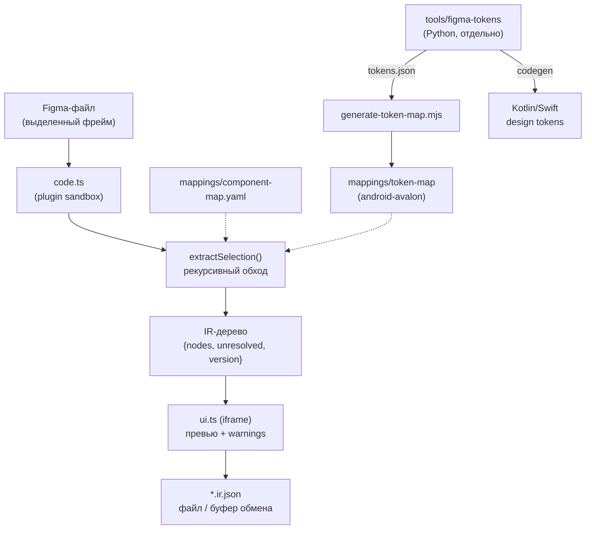

# Figma-Normalizator — как оно работает (по шагам)

Состояние на коммит `f2cb9e7`. Все 173 теста проходят (`npx vitest run`, 26 файлов).

---

## 0. Что это вообще и зачем

Figma REST API отдаёт «геометрию без смысла»: абсолютные координаты, вектора,
низкоуровневые enum'ы Auto Layout, инстансы компонентов развёрнутые в полное
поддерево, цвета как литералы с непрозрачными id переменных, без информации о
темах/режимах.

Figma **Plugin API** (работающий внутри самой Figma) видит то, чего не видит REST:
резолвнутые component properties, styled text segments, режимы переменных.
Проект использует это и выдаёт чистый версионированный **IR** (Intermediate
Representation), который потом сможет потреблять кодогенератор, не зная ничего
о внутренней модели документа Figma.

**Stage 1** (текущий) = только извлечение на стороне Figma. Нет MCP-сервера, нет
кодогенерации в Compose, нет LLM внутри плагина.

---

## 1. Структура монорепозитория

npm workspaces, 4 пакета + один внешний Python-инструмент:

```
schema/     @figma-normalizator/schema    — JSON Schema IR v1 + сгенерированные TS-типы
plugin/     @figma-normalizator/plugin    — сам плагин Figma (extractor + UI-панель)
mappings/   @figma-normalizator/mappings  — component-map.yaml + token-map (Figma → Kotlin)
fixtures/   @figma-normalizator/fixtures  — корпус мок-сценариев + замороженные снапшоты IR
tools/figma-tokens/                       — Python-генератор токенов (скопирован, НЕ в workspaces)
```

CI (`.github/workflows/ci.yml`): `npm install` → `lint` → `typecheck` → `build` → `test`
на каждый push в main и на каждый PR. Node 20.

---

## 2. Поток данных целиком



Ключевая мысль: **две независимые ветки**, которые сходятся только в поле
`TokenValue.symbol`:

- ветка «структура экрана» — плагин → IR;
- ветка «дизайн-токены» — Python-генератор → tokens.json → token-map → symbol.

---

## 3. Шаг за шагом: жизненный цикл одного экспорта

### Шаг 3.1. Запуск плагина

`plugin/manifest.json`:

- `main: dist/code.js`, `ui: dist/ui.html`
- `editorType: ["figma", "dev"]`, `capabilities: ["inspect"]` (панель Dev Mode)
- `documentAccess: "dynamic-page"`, `networkAccess.allowedDomains: ["none"]` — сеть запрещена

`code.ts → initializePlugin(figma)`:

1. `figma.showUI(__html__, {width: 360, height: 560})` — панель живёт всю сессию.
2. Сразу постит `selection-changed` в UI.
3. Подписывается на `figma.on("selectionchange")` и на `figma.ui.on("message")`.

Протокол сообщений — `plugin/src/messages.ts` (единый источник правды для обеих сторон):

- Plugin → UI: `selection-changed`, `ir-result`, `error` (коды: `empty-selection`,
  `budget-exceeded`, `node-not-found`, `unsupported`, `unknown`, `symbol-leak`).
- UI → Plugin: `extract`, `select-node`, `export`.

### Шаг 3.2. Нажатие Extract → `handleExtract()`

1. Пустое выделение → `error: empty-selection`.
2. `extractSelection(figma, selection, { fileKey: figma.fileKey ?? "" })` — **без** `version`,
   версия считается позже как хэш контента.
3. `findSymbolPath(result)` — защита в глубину: рекурсивный поиск любого `Symbol`
   в готовом дереве. `postMessage` использует structured clone, который не умеет
   сериализовать `Symbol` (`figma.mixed`) и уронил бы панель с невнятной ошибкой
   «Cannot unwrap symbol». Здесь вместо этого — понятный `symbol-leak` с путём.
4. Постит `ir-result` + `source: {fileKey, nodeId, version}`.
5. `NodeBudgetExceededError` → `error: budget-exceeded` (баннер, не тихое усечение).

### Шаг 3.3. Обход дерева — `extractor/index.ts`

Функция `extractNode(figma, node, parent, ctx, budget, source, isTopLevel)`:

```
budget.tick()                     ← бюджет узлов + кооперативный yield
  ↓
node.visible === false            → null (выбрасываем)
  ↓
isAssetNode(node)                 → asset-нода (не спускаемся внутрь)
  ↓
type === "INSTANCE"               → buildInstanceNode()
      ├── kind: "mapped"          → opaque instance-нода, дети НЕ обходятся
      └── kind: "unmapped"        → фолбэк в handleContainerLike() (дети обходятся!)
  ↓
type === "TEXT"                   → buildTextNode()
  ↓
FRAME/COMPONENT/COMPONENT_SET/    → handleContainerLike()
GROUP/BOOLEAN_OPERATION/SECTION
  ↓
всё остальное                     → null
```

`handleContainerLike()` — три случая:

- 0 детей и нет Auto Layout → `null` (пустой фрейм не несёт информации);
- 1 ребёнок и нет Auto Layout → **прозрачная обёртка**, рекурсия сразу в ребёнка
  (имя обёртки всё равно попадает в `source.path`);
- иначе → `buildLayoutNode()`.

`buildLayoutNode()` собирает `LayoutNode`: `direction`, `gap`, `padding`,
`mainAxisAlign`, `crossAxisAlign`, `sizing`, `background`, `cornerRadius`,
`children`, `source`. Дети обходятся, затем к ним применяются `collapseLists()` и
`groupOverlayChildren()`.

### Шаг 3.4. Нормализация layout — `extractor/layout.ts`

| Figma                                                 | IR                                             |
| ----------------------------------------------------- | ---------------------------------------------- |
| `layoutMode: HORIZONTAL/VERTICAL/иное`                | `direction: row / column / stack`              |
| `primaryAxisAlignItems: MIN/MAX/CENTER/SPACE_BETWEEN` | `mainAxisAlign: start/end/center/spaceBetween` |
| `counterAxisAlignItems: MIN/MAX/CENTER/BASELINE`      | `crossAxisAlign: start/end/center/start`       |
| все дети с `layoutAlign === "STRETCH"`                | `crossAxisAlign: "stretch"`                    |

`resolveSizing(node, parent)` — документированная эвристика с приоритетами:

1. родитель — Auto Layout и нода тянется (`layoutGrow === 1` по главной оси или
   `layoutAlign === "STRETCH"` по поперечной) → `fill`;
2. иначе сама нода — Auto Layout → её `primaryAxisSizingMode`/`counterAxisSizingMode`:
   `AUTO → hug`, `FIXED → fixed`;
3. иначе → `fixed`.

`padding`: если все 4 стороны равны — эмитится сокращение `{ all }`, иначе 4 поля.

### Шаг 3.5. Резолв токенов — `extractor/tokens.ts` (сердце проекта)

`resolveTokenValue(figma, nodeId, boundVariables, field, rawValue)`:

- нет привязки в `boundVariables[field]` → `{ token: null, value: rawValue }` +
  `UnresolvedEntry("unbound-literal")`. Путь токена **никогда не выдумывается**;
- есть привязка → `resolveVariable()`.

`resolveVariable(figma, variableId)` возвращает `{ token, value, modes?, symbol? }`:

- `token` = `variable.name` как есть (в Figma имена переменных уже через `/`);
- `modes` = `{ имя_режима → значение }` из `valuesByMode` + имена режимов коллекции
  (эмитится только если режимов > 1);
- `value` = значение режима по умолчанию коллекции;
- `symbol` = `findTokenSymbol(variable.name)` из бандла token-map.

**Резолв алиасов** (`resolveModeValue`) — самая нетривиальная часть:

- значение режима может быть не литералом, а `{type: "VARIABLE_ALIAS", id}` —
  так семантические токены строятся поверх примитивных;
- алиасы разворачиваются **рекурсивно**, до литерала;
- эмитится всегда имя **внешней** (семантической) переменной, не примитива;
- **кросс-коллекционное сопоставление режимов**: у целевой переменной может быть
  другой набор режимов. Ищется режим с **тем же именем**; если нет — берётся
  `defaultModeId` целевой коллекции (осознанное решение, задокументировано в README);
- **защита от циклов**: `MAX_ALIAS_DEPTH = 10` + множество посещённых id →
  `UnresolvableAliasChainError` → `UnresolvedEntry("unresolvable-alias-chain")`.

Цвет: `colorToHex()` → `#RRGGBB` или `#RRGGBBAA` (альфа добавляется только при `a < 1`).

`resolveFillColor()`: берёт **первый видимый SOLID** paint. Если `fills` — `figma.mixed`
(Symbol) → `mixed-value`. Если SOLID-заливок нет вообще → `null` без варнинга
(«нет цвета» ≠ «цвет не резолвнулся»).

`resolveTypographyToken()`: смотрит привязку `fontName`, затем `fontSize`; возвращает
`TokenRef { token, symbol? }` или `{ token: null }` + `unbound-literal`.

### Шаг 3.6. Текст — `extractor/text.ts`

`node.getStyledTextSegments(["fontSize","fontName","fills","boundVariables"])`:

- 0–1 сегмент → `text` = строка, `typography`/`color` на уровне ноды;
- 2+ сегментов → `text` = массив `StyledSegment[]` (`{text, typography, color}`),
  а `typography`/`color` ноды = `null` (нет единого стиля).

### Шаг 3.7. Инстансы — `extractor/instance.ts` + `mappings/src/index.ts`

1. `getMainComponentAsync()`; `null` → `missing-main-component`.
2. `resolveComponentSetName()` — идём вверх до `COMPONENT_SET`, иначе имя компонента.
3. `safeReadComponentProperties(node)` — `componentProperties` это **геттер**, который
   может бросить исключение при конфликтующих variant-определениях в самом файле Figma →
   `unreadable-component-properties`, инстанс становится unmapped (дети обходятся).
4. `findComponentMapEntry(имя)` — **точное строковое совпадение** по `component-map.yaml`.
5. `resolveRouting(entry, variantValues)` — структурная развилка
   (`Buttons` + `Type=Icon Only` → `Buttons (Type=Icon Only)` → `AppIconButton`).
6. `status === "mapped"` — единственный авторитетный сигнал. Блок `compose` может быть
   заполнен и при `status: unmapped` (Checkbox/Radio Button документируют «когда-нибудь»),
   это НЕ считается маппингом.
7. Для mapped-инстанса собираются `props`/`slots`:
   - `VARIANT` → `resolveStateValue()` (Switch: `State=On` → `checked=true`), затем
     `resolveVariantValue()` → `{variant, from}` или `{variant: null, from}` + `unmapped-variant`;
     `no-mapping` (например чистый роутинговый `Type`) — молча пропускается;
   - `TEXT` → единственное текстовое свойство кладётся в `props.text` (конвенция Figma),
     несколько — по camelCase-именам;
   - `BOOLEAN` → `props[camelCase] = {value}`;
   - `INSTANCE_SWAP` → `slots[camelCase] = null` (содержимое слота не резолвится — отложено).
8. **Граница инстанса**: opaque только если mapped. Unmapped-инстанс проваливается в
   `handleContainerLike()` и его реальные дети извлекаются (варнинг сохраняется —
   это гигиена, а не усечение).

### Шаг 3.8. Списки — `extractor/list.ts`

`structuralSignature(node)` — детерминированная подпись без контента: `type`,
`layoutMode`, отсортированные **имена** (не значения) component properties, рекурсивно дети.
Сравнение через `JSON.stringify`. Прогон из **3+** подряд идущих структурно одинаковых
соседей с одинаковым `layoutPositioning` схлопывается в `ListNode { itemTemplate, itemCount }`.
Если геттер `componentProperties` бросил — подпись получает уникальный маркер-счётчик
(fail-safe: «не похож ни на кого, включая другого сломанного соседа»).

### Шаг 3.9. Оверлеи — `extractor/overlay.ts`

Дети с `layoutPositioning === "ABSOLUTE"` вынимаются из потока и собираются в один
`OverlayNode`, вставляемый на позицию первого такого ребёнка. У каждого — `align`
(`computeOverlayAlign`: родитель делится на трети по каждой оси, ребёнок бакетится по
центру) и `offset {x, y}`. Синтетический `source.nodeId` = `"<parentId>#overlay"`.
Плюс `UnresolvedEntry("absolute-positioning")` — чтобы дизайнер это увидел.

### Шаг 3.10. Ассеты — `extractor/asset.ts`

`isAssetNode()`: `VECTOR`; или `INSTANCE`, в имени которого есть «icon»; или
контейнер, **все** потомки которого векторо-подобные (`VECTOR/BOOLEAN_OPERATION/
STAR/ELLIPSE/RECTANGLE/LINE/POLYGON`).

`inferAssetType()`: имя содержит «icon» → `icon`; иначе top-level и ≥120×120 →
`illustration`; иначе `image`.
`exportRef` = `slugify(node.name)` → `icon_chevron_right`. Геометрия/path-данные
никогда не эмитятся — только ссылка на экспорт + размеры.

### Шаг 3.11. Бюджет — `extractor/budget.ts`

`DEFAULT_NODE_BUDGET = 5000` узлов; каждые `YIELD_EVERY = 200` узлов —
`await setTimeout(0)` (кооперативная отдача потока, чтобы песочница не зависала).
Превышение → исключение, а не тихое усечение.

### Шаг 3.12. Provenance и версия — `provenance.ts` + `versioning.ts` + `canonical.ts`

Каждая IR-нода несёт `source: { nodeId, fileKey, version, path }`, где `path` —
цепочка имён узлов от корня выделения **включая собственное имя**.

`version` — **не** версия файла Figma (Plugin API её не отдаёт per-node). Это
детерминированный хэш контента: `canonicalStringify(nodes)` → FNV-1a 64-bit →
`c1-<16 hex>`. `VERSION_SCHEME = "c1"` позволит отличить будущую смену алгоритма.
После вычисления `withVersion()` рекурсивно проставляет его во все `Provenance`-блоки
(они определяются структурно — по наличию `nodeId/fileKey/version/path`).

`canonicalize()` рекурсивно сортирует ключи всех объектов (порядок массивов не трогает —
он смысловой). Через него идут: файл, буфер обмена и хэш версии. Гарантия:
**повторный экспорт неизменённого выделения даёт побайтово идентичный результат.**
Тест `determinism.test.ts` проверяет именно строковое равенство, не `toEqual`.

### Шаг 3.13. Панель UI — `ui.ts` + `ui/*`

- Шапка: имя и тип текущего выделения (обновляется на `selectionchange`).
- **Extract** → JSON-превью (`result.nodes`) + список **Warnings**, сгруппированный
  по `reason` (`ui/warnings.ts` → `buildWarningsViewModel`), у каждой записи
  `detail` + `nodeId` + кнопка **Select** (шлёт `select-node`, плагин делает
  `currentPage.selection = [node]` + `viewport.scrollAndZoomIntoView`).
- **Collapse all / Expand all** — сворачивает записи, оставляя заголовки групп
  и счётчики (для экранов с десятками `unmapped-component`).
- **Export** → скачивание `{fileKey}_{nodeId}_{version}.ir.json` (`ui/filename.ts`,
  небезопасные символы → `-`).
- **Copy to clipboard** → `ui/clipboard.ts`: сначала `navigator.clipboard.writeText`,
  при неудаче — фолбэк на `document.execCommand("copy")` через скрытую textarea,
  при полном провале — видимый статус-текст (никогда не молча).
- Вся нетривиальная логика вынесена в чистые функции и покрыта тестами; сам `ui.ts` —
  только DOM-проводка.

### Шаг 3.14. Сборка

`plugin/scripts/build.mjs` (esbuild): `src/code.ts` → `dist/code.js` (IIFE, es2017);
`src/ui.ts` бандлится в память и инлайнится в `dist/ui.html` вместо плейсхолдера
`<!-- BUILD:UI_SCRIPT -->` (у iframe плагина нет загрузки внешних ресурсов).
`dist/` в `.gitignore`.

---

## 4. Схема IR v1 — `schema/ir/v1/schema.json`

Дискриминированное объединение по `kind`, 6 видов нод. Везде `additionalProperties: false`.

| kind       | обязательные поля                                                                                          |
| ---------- | ---------------------------------------------------------------------------------------------------------- |
| `layout`   | direction, gap, padding, mainAxisAlign, crossAxisAlign, sizing, background, cornerRadius, children, source |
| `text`     | text (string \| StyledSegment[]), typography, color, source                                                |
| `instance` | component, figmaComponentSetName, figmaComponentKey, props, slots, layout, unresolved, source              |
| `asset`    | assetType (icon\|image\|illustration), exportRef, width, height, source                                    |
| `overlay`  | children[{node, align, offset?}], source                                                                   |
| `list`     | itemTemplate, itemCount, source                                                                            |

Вспомогательные типы: `Provenance`, `TokenValue {token, value, modes?, symbol?}`,
`TokenRef {token, symbol?}`, `UnresolvedEntry {nodeId, reason, detail?}`,
`PropValue` (TextOrBoolean `{value}` | Variant `{variant, from}`), `Sizing`, `Padding`,
`LayoutFieldsPartial`.

Инварианты, зафиксированные прямо в `description` схемы:

- IR от одного и того же входа обязан быть побайтово одинаковым — никаких таймстампов,
  случайных id и недетерминированного порядка;
- любое нерезолвнутое значение обязано попасть в ближайший `unresolved[]`, а не быть
  тихо подменённым или выброшенным;
- ломающее изменение любой ноды требует соседней схемы `v2`.

TS-типы генерируются из схемы (`schema/scripts/generate-types.mjs` → `src/generated/ir.ts`,
руками не править). `irSchemaV1` экспортируется для рантайм-валидации через ajv.

---

## 5. Mappings

### 5.1. component-map.yaml

Источник: библиотека Figma **NUI - iOS Components** (`z4Ns3yQoXwMgjky6H9WYtP`) →
Compose-компоненты **Android_Avalon** (`com.dexcom.platform.design.component.*`).

**Всего 10 записей**: 7 mapped (Buttons, Buttons (Type=Icon Only), Badges, Banners,
Info Box, Tags, Switch), 3 unmapped (Checkbox, Radio Button, Accordions).

Ключевые концепции: `status` (mapped/unmapped на уровне записи и отдельного значения),
обязательный `reason` у всего unmapped, `routing` (структурная развилка),
`mappingKind: state-based` + `stateMapping` (Switch/Checkbox/Radio), `notes`.
Покрываются **только** VARIANT-свойства; TEXT/BOOLEAN/INSTANCE_SWAP — задача экстрактора.

YAML компилируется в `src/generated/component-map.json` скриптом `generate-map.mjs`
(руками не править — регенерировать и коммитить).

### 5.2. token-map

`generate-token-map.mjs --input <tokens.json> --name <product>` читает
`collections[name].tokens` из интермедиата Python-генератора и выдаёт плоский
`token-map/<product>.token-map.json`:

```jsonc
{
  "collection": "base",
  "path": "color/surface/action/primary/default",   // == IR TokenValue.token
  "type": "COLOR",
  "values": { "light": "#2B2855", "dark": "#ACA8E3" },
  "alias": { "path": null, "byMode": {...}, "source": "primitives" },
  "description": "...",
  "symbol": "AppTheme.semanticColors.surface.action.primary.default", // или null
  "symbolReason": "..."   // присутствует только когда symbol === null
}
```

**Главный результат исследования** (см. `mappings/token-map/README.md`): путь в IR и
путь в `tokens.json` — **одна и та же строка** (обе стороны читают `variable.name`
сырым), реконсиляция не нужна. Sanitize происходит только в Kotlin-кодогене.

Из **2371** токена символ выводится уверенно только для **246** — это ветка
`color/` коллекции `base`, потому что `DsThemeColors.kt` объявляет
`typealias SemanticColors = ...token.base.color.Color`, то есть 1:1 к сгенерированному
классу. Остальное (`opacity`, `radius`, `border-width`, `typography`, `components`,
`layout`, `primitives`, …) — руками написанные data class'ы в `themedata/`, вывести
механически нельзя → `symbol: null` + `symbolReason`.

`bundle-token-map.mjs` берёт `android-avalon.token-map.json`, выбрасывает записи с
`symbol: null` и пишет `src/generated/token-map.json` — плоский `{path, symbol}[]`
(~246 записей). `findTokenSymbol()` строит `Map` один раз и даёт O(1).

---

## 6. tools/figma-tokens (Python) — соседняя половина пайплайна

CLI `figma-tokens` (click), Python ≥3.9, зависимости click + requests.

Поток: **Figma Variables API → resolver → enricher → graph → codegen**.

1. Конфиг (TOML/JSON) + флаги CLI; токен из `--token`/`--token-file`/`FIGMA_TOKEN`.
2. `FigmaClient.get_local_variables()` → сырой `json/figma-raw.json`.
3. `TokenResolver.resolve()` — `VARIABLE_ALIAS` → `alias:<id>`, рекурсивный резолв
   по режимам; `alias_path` схлопывается только если **все** режимы алиасят одну цель,
   иначе сохраняется `alias_by_mode`. Отбрасывает самоссылки и алиасы на родительские пути.
4. `TokenEnricher.enrich()` — достраивает алиасы сопоставлением значений (в основном цвета).
5. `graph/collections.py` — классификация коллекций **без хардкода имён**:
   primitive (один режим, нет внешних зависимостей) / product (структурно
   идентичная группа, ≥90% пересечения путей) / semantic (база = максимум токенов) /
   leaf (≥2 upstream-зависимости). Плюс `branch_owners`, циклы, product groups.
6. `compute_theme_modes()` — для Kotlin выбрасываются режимы со словом `ios`,
   для Swift — с `android`; предпочитаются имена вида light/dark/default/inverted.
7. Исключения из `configs/collections.toml` (`exclude`, `exclude-branches`): коллекция
   выкидывается, а алиасы в неё **деградируют до литералов**, чтобы код не ссылался
   на несуществующий класс.
8. Кодоген: `KotlinGenerator` / `SwiftGenerator` — вложенные data class'ы, фабрики
   на режим, билдеры на продукт.
   Типы: `COLOR/FLOAT/STRING/BOOLEAN` → Kotlin `Color/Float/String/Boolean`,
   Swift `Color/CGFloat/String/Bool`.
   Имена: `to_camel_case` для свойств, `to_pascal_case` для классов, экранирование
   ключевых слов бэктиками; Swift дополнительно разруливает затенение типов через
   `_TypeAliases.swift`.
9. Всегда пишется интермедиат `json/tokens.json` (`schema_version: 1`, `tree`,
   `collections`, `graph`, `builders`) — это и есть вход для `generate-token-map.mjs`.

---

## 7. Тесты и фикстуры

- **plugin**: 20 spec-файлов на каждый модуль экстрактора + `code.ts` + чистые UI-функции.
  Реального `figma` нет — есть `test/mockFigma.ts` (`createMockFigma()`) и
  `test/nodeBuilders.ts` (`mockFrame/mockInstance/mockText/...` + `resetAutoIds()`).
- **fixtures**: 5 сценариев (`card-with-button`, `instance-list`,
  `row-with-icon-and-accordion`, `overlay-badge-over-avatar`, `dashboard-screen`),
  каждый = мок-дерево + **замороженный** `expected.ir.json` (реальный вывод экстрактора).
  `snapshot.test.ts` ловит любой дрейф; `schema-validation.test.ts` валидирует ajv'ем.
  Обновление только вручную: `npm run fixtures:update -w fixtures` с ревью диффа.
- **mappings**: тесты лукапов, генерации token-map и бандла.
- **schema**: `ir-schema.test.ts` валидирует `schema/fixtures/*.json`.

Важно: все «экраны» в корпусе — **синтетические моки**, а не захваты реальной Figma
(в CI нет доступа к Figma API).

---

## 8. Проверка на реальных данных

Файл `daily_42487-22668_c1-790c0e5841aac834.ir.json` (реальный экран Daily, 245 КБ,
теперь закреплён как golden-фикстура в `fixtures/src/real-world/`, см.
`fixtures/src/real-world/README.md` и backlog S6):

| метрика                       | значение                                                                                             |
| ----------------------------- | ---------------------------------------------------------------------------------------------------- |
| корневых нод                  | 1 (`layout`, direction `stack`)                                                                      |
| всего нод                     | 134 (`layout` 77, `asset` 25, `text` 21, `overlay` 8, `list` 3, **`instance` 0**)                    |
| глубина вложенности           | до 9 уровней `path`                                                                                  |
| записей в `unresolved`        | **361**                                                                                              |
| — `unbound-literal`           | 307 (cornerRadius 84, itemSpacing 64, paddingLeft 62, fills 31, typography 20, остальные padding 46) |
| — `unmapped-component`        | 46 (26 различных component set'ов)                                                                   |
| — `absolute-positioning`      | 8                                                                                                    |
| объектов-токенов              | 313, из них `token: null` — **251 (80%)**                                                            |
| различных резолвнутых токенов | 32, с `modes` — 40 объектов                                                                          |
| токенов с `symbol`            | **14 объектов / 5 различных символов**                                                               |
| `fileKey` во всех `source`    | **пустая строка**                                                                                    |

Схему IR v1 файл проходит: все корневые ноды валидны (проверено ajv 2020).

---

## 9. Быстрая шпаргалка по командам

```bash
npm install                      # корень, все workspaces
npm run lint                     # eslint по всему репо
npm run typecheck                # tsc --noEmit в каждом пакете
npm test                         # vitest run (173 теста)
npm run build                    # сборка всех пакетов
npm run format / format:check    # prettier

npm run build -w plugin          # → plugin/dist/{code.js,ui.html}
npm run generate:map -w mappings         # component-map.yaml → JSON
npm run generate:token-map -w mappings   # tokens.json → token-map/*.json
npm run bundle:token-map -w mappings     # token-map → src/generated/token-map.json
npm run fixtures:update -w fixtures      # перезапись замороженных снапшотов

# Загрузка в Figma: Plugins → Development → Import plugin from manifest…
#                   → выбрать plugin/manifest.json
```

---

## 10. Что дальше

Список известных пробелов, ограничений и идей по улучшению вынесен в отдельный
документ: **[BACKLOG.md](./BACKLOG.md)**.
